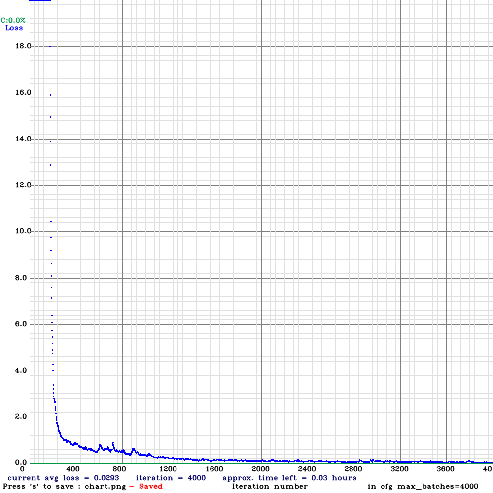

#  Deep Learning for Object recognition (Ball/Cube)

YOLOv3 is an object detection algorithm (based on neural nets) which can be used detect objects in live videos or static images, it is one of the fastest and accurate object detection method to date. YOLO uses a training set comprised of images and their corresponding bounding boxes (of target objects).
The training part of the model is done in Google Collaboratory, which is a hosted Jupiter notebook service that requires no configuration and provides free access to computing resources, including GPUs.

## Step1: Data Collection to Train a YOLOv3 model                
1-Collect images for each class (in our case 20 image per class).  
   
2-Download labelImg tool.
                                 
3- labeling all the pieces in each of the images : a txt file is is associated to each image.


## Step2 : Training
1- Connecting to Google Drive: Check if the GPU is enabled and load the files present in Google Drive on a file called yolo_custom_model_training .

```python
from google.colab import drive
drive.mount('/content/drive')
```

2- We will use Darknet, an open source neural network framework to train the detector

```python
!git clone 'https://github.com/AlexeyAB/darknet.git' '/content/drive/MyDrive/yolo_custom_model_training/darknet'
```

```python
%cd /content/drive/MyDrive/yolo_custom_model_training/darknet
!make
```
3- Configure the Darknet network for YOLOv3 Training by creating the YOLOv3 configuration file and loading the darknet weights 53.conv.74 .
4-
Generate files train.txt and test.txt by the Following python scripts
```python
!python custom_data/creating-files-data-and-name.py
!python custom_data/creating-train-and-test-txt-files.py
```
5- Train the model:
```python
!darknet/darknet detector train custom_data/labelled_data.data/content/drive/MyDrive/yolo_custom_model_training/darknet/cfg/yolov3_custom.cfg custom_weight/darknet53.conv.74 -dont_show
```
After 2hours of training we can find the weights files in yolo_custom_model_training/backup 
alse the yolov3 performance chart 
 
All the required files are in the Google drive below : 
https://drive.google.com/drive/folders/1CY94ACEKWnG_TN7CwvXA5geEgRX3_mlm?usp=sharing

