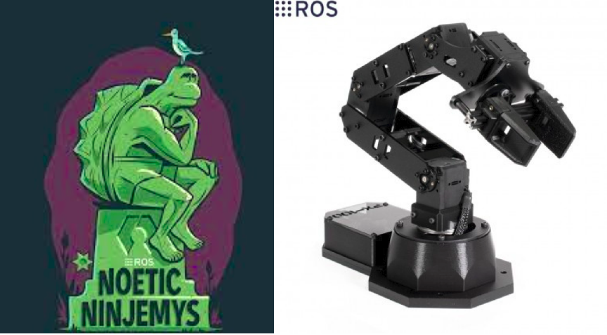

# Installing ROS and the Packages: 



The PincherX 100 is a small 5-DOF robot arm. The arm can be controlled through ROS or directly through its python API.


## Installing ROS
After installing Ubuntu 20.04 on our Raspberry Pi 4B , now we need to install ROS.
The Robot Operating System (ROS) is a set of software libraries and tools that help you build robot applications. From drivers to state-of-the-art algorithms, and with powerful developer tools, ROS has what you need for your next robotics project. And it's all open source.

For our robot , we need to install the _**Noetic**_ version.
Before starting , note that you should:
- follow  carefully all of the instructions!
- install the full-desktop version
- Add the environment setup to your .bashrc
- Install the dependencies for building packages

Here is the link to intsall **ROS_Noetic** **[link](http://wiki.ros.org/noetic/Installation/Ubuntu)**.

## Packages for Pincher X 100

To manipulate the Pincher X 100 robot , we need to install the following packages :
- **interbotix_descriptions** : contains the meshes and URDFs (including accurate inertial models for the robot-arm links) for the arms and turrets
- **interbotix_sdk**: contains the driver node that controls the physical robot and publishes joint states.
- **interbotix_gazebo** : contains the config files necessary to launch a robot arm (not turret) model in Gazebo, including tuned PID gains for ros_control 
- **interbotix_moveit** : ontains the config files necessary to launch a robot arm (not turret) using MoveIt either in Gazebo or on the physical robot.

In an Ubuntu terminal, we create a Catkin workspace called interbotix_ws.

```bash
$ mkdir -p ~/interbotix_ws/src
$ cd ~/interbotix_ws/
$ catkin_make
```
we ensure that workspace is sourced each time a terminal is opened.
```bash
$ source ~/interbotix_ws/devel/setup.bash
$ echo "source ~/interbotix_ws/devel/setup.bash" >> ~/.bashrc
```
In the workspace, we clone the git of interbotix ros arms / Noetic distribution
```bash
$ cd ~/interbotix_ws/src
$ git clone https://github.com/Interbotix/interbotix_ros_arms.git
$ cd ~/interbotix_ws/src/interbotix_ros_arms
$ git checkout noetic
```
Make sure all required dependencies are installed
```bash
$ cd ~/interbotix_ws
$ rosdep update
$ rosdep install --from-paths src --ignore-src -r -y
```
We install python3 as well as the modern_robotics library
```bash
$ sudo apt install python-pip
$ sudo pip install modern_robotics
```
once all the dependencies are installed, we make a catkin directory:
```bash
$ cd ~/interbotix_ws
$ catkin_make
$ source ~/.bashrc
```
We make sure that the computer will recognize the I2D2 module once the robot is connected:
```bash
$ sudo cp ~/interbotix_ws/src/interbotix_ros_arms/interbotix_sdk/10-interbotix-udev.rules /etc/udev/rules.d
$ sudo udevadm control --reload-rules && udevadm trigger
```
Connect the micro-usb cable (which should already be connected to the U2D2) to your computer and verify that the port appears under the /dev/ttyDXL link
```bash
$ cd /dev
$ ls
```
Familiarize yourself with the virtual robot model by running it in Rviz and playing around with the joint_state_publisher
```bash
$ roslaunch interbotix_descriptions description.launch robot_name:=px100 jnt_pub_gui:=true
```
You can also familiarize yourself with the physical arm of the robot
```bash
$ roslaunch interbotix_sdk arm_run.launch robot_name:=px100
```
By default, all robot motors are coupled, so it will be very difficult to manipulate it manually. To turn off the motors do:
```bash
$ rosservice call /px100/torque_joints_off
```
the arm and the gripper can be manipulated freely. the Rviz model accurately imitates the real robot. To make the robot hold a certain pose, manually hold the robot in the desired pose and run the following command:
```bash
$ rosservice call /px100/torque_joints_on
```


