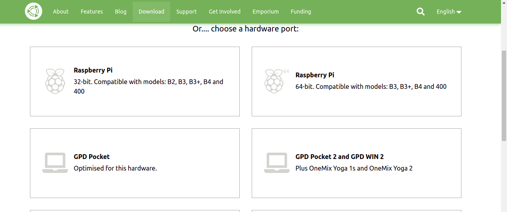
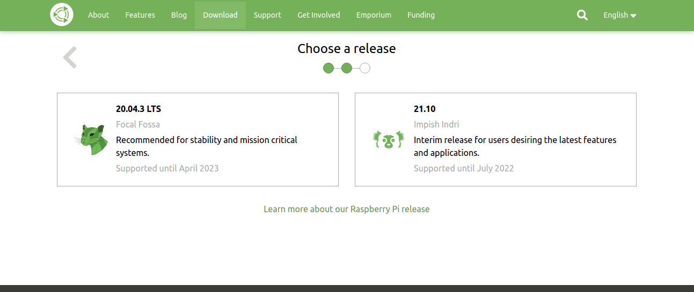
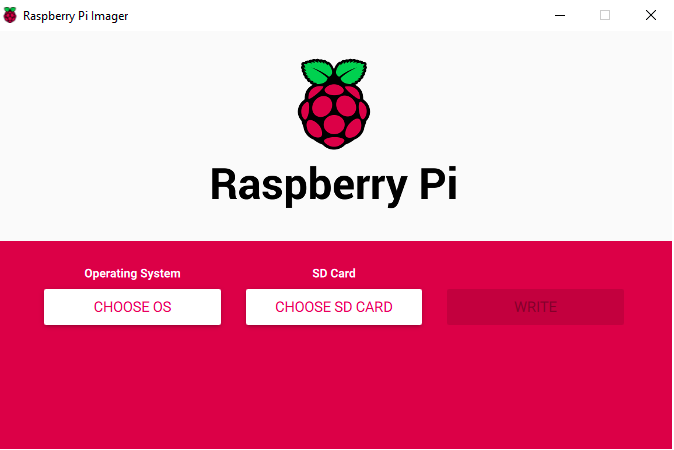
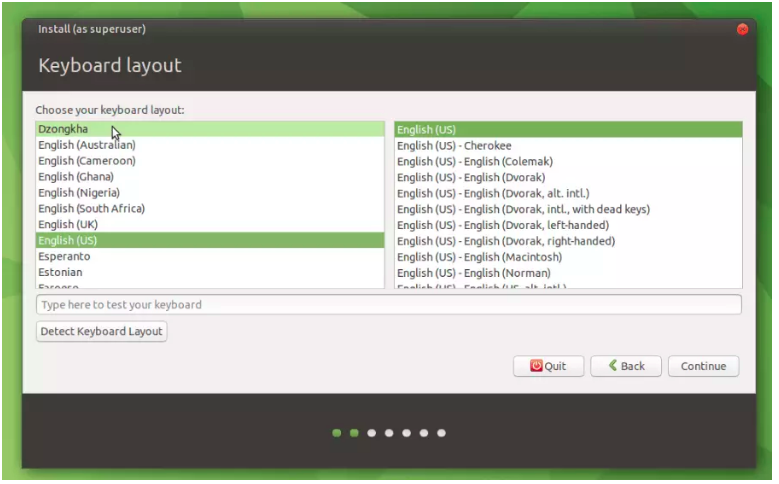
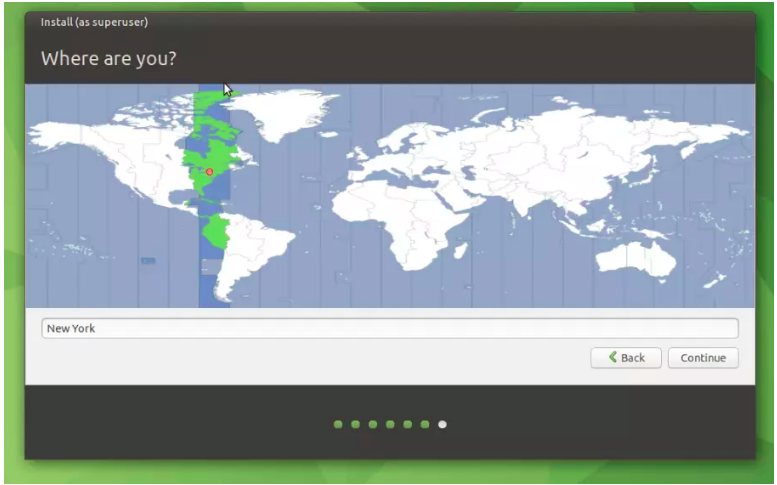
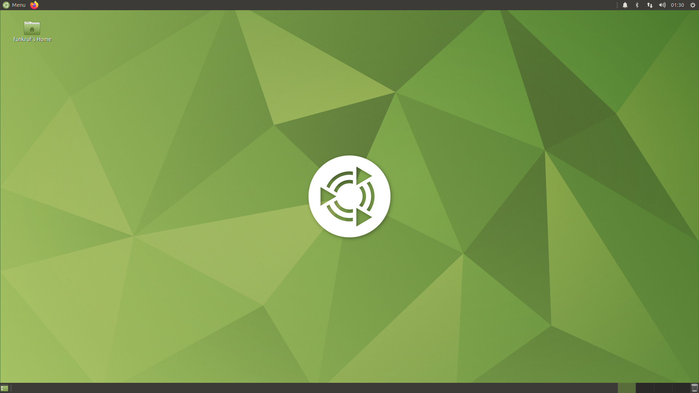
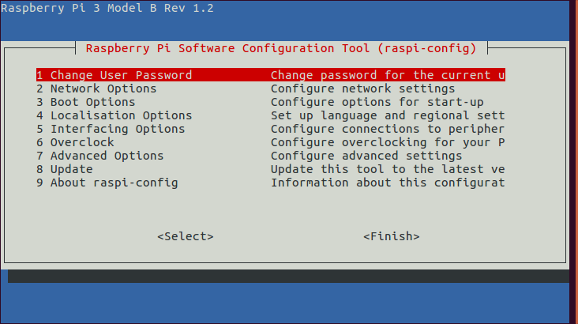
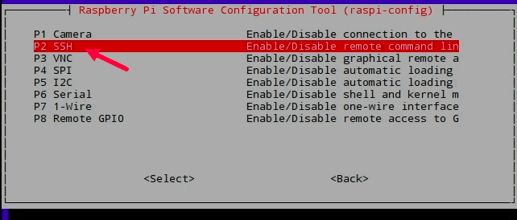

# Readme 


[](https://github.com/noursakis/PROJET-BRAS-ROBOTIQUE)

For our project , we are supposed to use the **ROS NOESTIC** distrubution in order to command our robot.
To do so , we need firstly to install **Ubuntu 20.04 Desktop** for Raspberry Pi 4.
In our case , we choosed the **Ubuntu 20.04 Mate** version.


## Pre-installation

We go to the [officiel website](https://ubuntu-mate.org/download/)  and download the system image for Raspberry 4 



We choose the 20.04 version.



Next , we upload the iso file to our Sd card ( using for example [RP imager](https://www.raspberrypi.com/software/))



## Installation
Ensure your HDMI screen and a USB keyboard are plugged in before powering the Pi. You will be able to see the boot process on screen and, eventually, the first run wizard.

First set your language, then set your keyboard layout.


Now pick yourself a time zone. 





You will be prompted to choose a local Wi-Fi network. Select your Wi-Fi network and enter the password in the network connection screen.

Now choose a user name and password.


After setting the keyboard layout, timezone and user credentials you’ll be taken to the login screen after a few minutes. And voila! You are almost done.


## Update and Upgrade

After successufuly installing Ubuntu Mate , we ended up with this desktop :

We check if our system is up to date , and upgraded.
In terminal
```sh
sudo apt-get update
sudo apt-get upgrade
```


## Installation of raspi-config menu
Raspi-config is a command that allows you to configurate your RP ( Enabling camera , ssh , vnc ....)
In the terminal :
```sh
wget http://mirrors.ustc.edu.cn/archive.raspberrypi.org/debian/pool/main/r/raspi-config/raspi-config_20201108_all.deb
sudo apt install lua5.1  libatopology2 libfftw3-single3 libsamplerate0 alsa-utils
sudo dpkg -i raspi-config_20201108_all.deb
```
Open raspi-config
```sh
sudo raspi-config
```

For more details , visit this [link](https://chuckmails.medium.com/enable-pi-camera-with-raspberry-pi4-ubuntu-20-10-327208312f6e)




Sometimes , you can have an old version of raspi-config , therefore you might not see some fearutres such as Interfacing options ( Camera , Ssh ....).
To solve this problem , we must update the firmware of our raspberry .
Follow the instructions [here](https://github.com/Hexxeh/rpi-update)


## Enabling Ssh
Ssh is a way to control your RPi remotley . To enable Ssh on ubuntu :
```sh
sudo apt install openssh-client
```

Next , you enable it on the raspi-config menu





