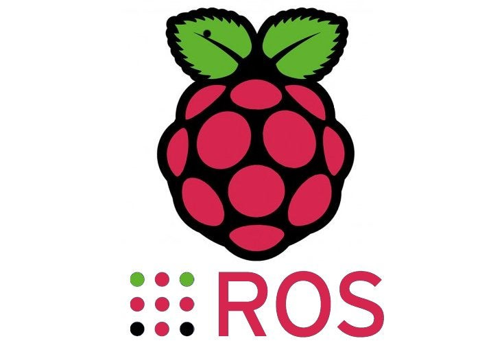

# The installation of the raspicam_node
ROS node for the Raspberry Pi Camera Module. Works with both the V1.x and V2.x versions of the module. We are using the v2.x cameras as they have better auto gain, and the general image quality is better.


## Installation
To start the installation run :
```sh
sudo apt install ros-noetic-raspicam-node
```
## Build Intructions
Instead of using a binary we can build from source following this section
This node is primarily supported on ROS Noetic, and Ubuntu20.04, and that is what these instuctions presume.
In the catkin_ws 
```sh
cd ~/catkin_ws/src
```
Download the source for this node by running the following command: 
```sh
git clone https://github.com/UbiquityRobotics/raspicam_node.git
```
There are some dependencies that are not recognized by ROS, so you need to create the file 
`/etc/ros/rosdep/sources.list.d/30-ubiquity.list `

Then add this line to the newly created file

> `yaml https://raw.githubusercontent.com/UbiquityRobotics/rosdep/master/raspberry-pi.yaml`

When done , run the update 
```sh
rosdep update
```
Install the ros dependencies,
```sh
cd ~/catkin_ws
rosdep install --from-paths src --ignore-src --rosdistro=noetic -y
```
The final step in the build instructions is to Compile the code
```sh
catkin_make
```
###  Verification 
After installing the raspicam_node on Ubuntu 20.04 with ROS Noetic, we have to make sure that the camera works properly by using this command 
```sh
raspistill 
```
Then we added the following lines below in `/boot/firmware/config.txt`
```sh
start_x=1
gpu_mem=512
```
And then we will be able to test it using :
```sh
raspistill -v -o test.jpg
```

## raspicam_node build
We already cloned the raspicam_node in the src file so we have to install the libraries
```sh
sudo apt install libraspberrypi-dev libraspberrypi0 libpigpiod-if-dev
```
And then type 
```sh
catkin_make
```
At this point, `catkin_make` said it needed some packages. It's possible I forgot one, catkin_make will tell you.
> 'Example: 'compressed_image_transport' -> apt install ros-noetic-compressed-image-transport 
```sh
sudo apt install ros-noetic-compressed-image-transport ros-noetic-camera-info-manager ros-noetic-diagnostic-updater
```
And the run this 
```sh
cd ..
catkin_make
```
If `catkin_make` takes more than a few minutes to build, it's possibly because the Pi is out of RAM.
If so, you can use a swapfile with this tutorial and then `catkin_make` only took like 2 minutes(luckily it worked for us without using this step).

### Testing the camera node 
On your PC:
```sh
roscore
```
On the ROBOT:
```sh
roslaunch raspicam_node camerav2_1280x960.launch
```
On your PC:
```sh
rqt_image_viewer
```
At the top of the image viewer, select the `raspicam_node` topic

## Useful links:
>'https://github.com/UbiquityRobotics/raspicam_node'

>'https://github.com/UbiquityRobotics/raspicam_node/issues/112'


