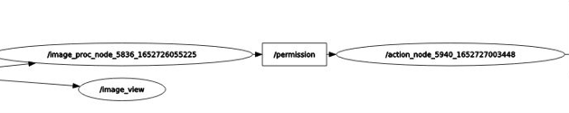
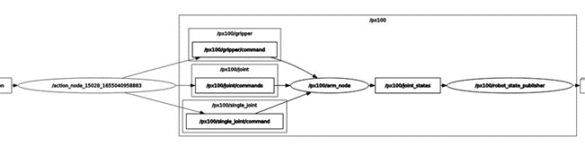
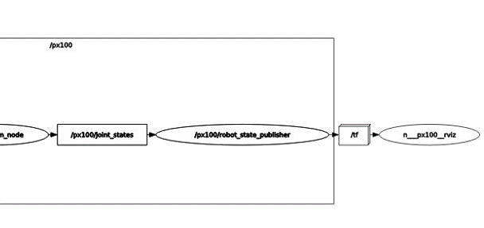

# The creation of action_node

### Overview 
 One of the primary purposes of ROS is to facilitate communication between the ROS nodes  by sending and receiving messages through topics. Nodes may publish messages on a particular topic or subscribe to a topic to receive information. The node that keeps track of which nodes are publisher nodes and which nodes are subscriber nodes is called the ROS Master. Without the ROS Master, nodes would not be able to communicate with each other.
 []()

### About this node
This node is a publisher and subscriber at ones. It receives data from the image processing node and sends data to the standard nodes of joints in order to manipulate them. 


Being a subscriber to the topic /permission, it makes the robot move according to the permission received and depending on the identity of the detected object. This is done by publishing the actions directly in the topics dedicated to the operation of pincher X. These are standard topics of the ros allowing the control of the movement. These topics, as illustrated in the graph below are:
> • /px100/gripper which controls the gripper and of course the “Gripper” servo motor
• /px100/joint/commands which allows us to do the Sleep Pose and Home Pose positions
• /px100/single_joint/commands which allows us to run the servo motors according to the desired application

 
 
These three topics deliver the information in parallel to an explicitly present node /px100/arm_node which communicates with the node /px100/robot_state_publisher via the topic /px100/joint_states.
The latter /px100/joint_states contains the information of the joints in order to calculate the kinematic coordinates of the robot and publish them to /tf. This information includes name, position (rad or m), speed (rad/s or m/s) and effort (Nm or N). The type of this information is generally std_msgs and more precisely: string for the name, float64 for the position, speed and effort.


 
The /px100 topic which contains the latest topics in turn publishes to a /tf package. It is a standard ros package that allows the user to track coordinates over time. It maintains the relationship between coordinate frames in a tree structure over time. All data will be transported by /tf to rviz whose node is n___px100__rviz. The rviz tool is ROS Visualization Tool. It is a very powerful visualization tool that allows you to visualize the data received. Thanks to this tool we can see the behavior in real time of the robot on our screen.


Don't forget to mark the file as executable using the following command
```sh
chmod +x filename.py
```
You can execute it using 
```sh
python3 filename.py
```
And you can also modify it using :
```sh
gedit filename.py
geany filename.py
nano filename.py
```
You can find in this folder the corresponding code explained with details in the comments.

## Ressources
- https://docs.ros.org/en/api/
- http://wiki.ros.org/ROS/Tutorials/WritingPublisherSubscriber%28python%29
- https://github.com/Interbotix/interbotix_ros_arms
- https://github.com/Interbotix/interbotix_ros_arms/blob/cb9f5feb6c51190561e05896ba39cd1cce133875/interbotix_sdk/src/interbotix_sdk/robot_manipulation.py#L135
- http://wiki.ros.org/rostopic
- https://www.trossenrobotics.com/docs/interbotix_xsarms/specifications/px100.html# 
- http://wiki.ros.org/rospy/Overview/Publishers%20and%20Subscribers
- http://wiki.ros.org/ROS/Tutorials/UnderstandingTopics
- https://www.theconstructsim.com/morpheus-chair-dynamixel-servos-with-robot-arm-ros-s4-ep-1/

